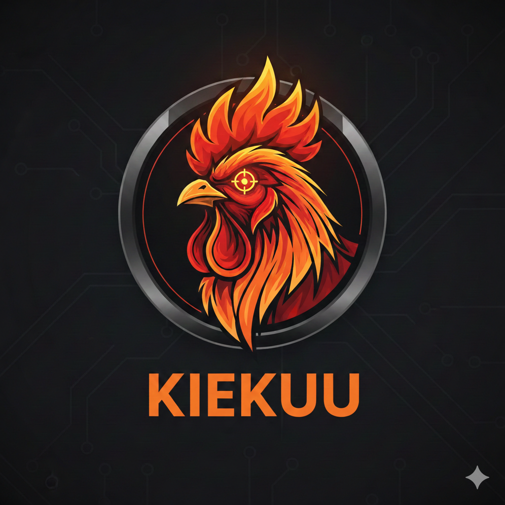

# Kiekuu

**Kiekuu** on pelillistetty oppimisalusta, joka on suunniteltu Suomen sopimuspalokuntien (VPK) koulutustarpeisiin. Se toimii osaamisen "herättäjänä" ja teoreettisena pohjana **Vaste**-ekosysteemille.

Sovellus pyrkii noudattamaan  **Pelastusopiston sopimushenkilöstön opetussuunnitelmaa (OPS)**. Lisäksi lähdemateriaalina on käytetty muuta pelastusalan materiaalia sekä Pelastusopiston julkaisuja.

## 🌟 Avainominaisuudet
- **OPS-pohjainen progressio:** Sisältö on jaettu tasoihin, jotka vastaavat palokuntalaisen urapolkua ja virallisia kurssikokonaisuuksia.
- **Älykäs Tutor (Vertex AI):** Väärän vastauksen sattuessa Firebase AI selittää vastauksen perustuen viralliseen kurssimateriaaliin.
- **Lähdeviittaukset:** Jokainen vastaus sisältää viitteen viralliseen oppimateriaaliin tai lainsäädäntöön.
- **Vaste-integraatio:** Kiekuu valmentaa käyttäjän ammattitaitoa, jotta operatiivinen työ Vaste-sovelluksella on sujuvaa.

## 🛠 Teknologia-pino
- **Frontend:** React + Vite (JavaScript)
- **Tyylittely:** Tailwind CSS + shadcn/ui (Mobile-First approach)
- **Backend:** Firebase (Auth, Firestore, Cloud Functions)
- **AI-moottori:** Vertex AI for Firebase (Gemini 1.5 Flash)
- **Design Philosophy:** Mobile-first responsive design for optimal UX on all devices

## 📈 Tasojärjestelmä (Arvot)
1. **Harjoittelija:** Palokuntatoiminnan perusteet, työturvallisuus ja yksikkötunnusten perusteet.
2. **Nuorempi sammutusmies:** Pelastustoiminnan peruskurssin alkuosa ja perustaidot.
3. **Sammutusmies:** Pelastustoiminnan peruskurssi suoritettu, sammutustekniikka ja tieliikennepelastaminen.
4. **Vanhempi sammutusmies:** Syventävä osaaminen, erikoistaitojen perusteet ja kokemus.
5. **Ryhmänjohtaja:** Yksikönjohtajakurssi (YS) (Taktiikka, VIRVE-viestintä, tilannearvio).
6. **Palokunnan päällikkö:** Hallinnollinen johtaminen, vastuut ja lainsäädäntö.

## 📄 Lisenssi
Tämä projekti on lisensoitu **MIT-lisenssillä**.

## 🗒️ Backlog
- Anonymous users: evaluate cleanup of stale accounts and revisit session reuse behavior (Firebase Auth persistence vs storing UID locally).

## Logo

